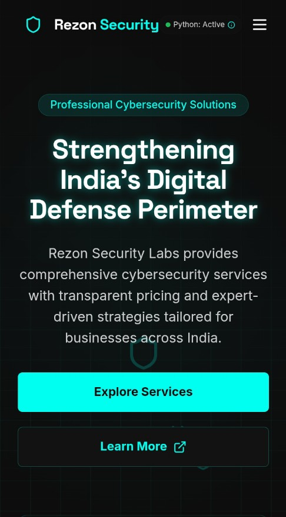

<div align="center">
  
  
  <h1>🛡️ Rezon Security Labs</h1>
<h2> there won't be any host  </h2>
  <p>
    <strong>India's Premier Cybersecurity Defense Platform</strong>
  </p>
  
  <p>
    <a href="https://github.com/RezonAi-Tech/rezonlabs">
      
    </a>
    <a href="https://x.com/PrakharYud">
      
    </a>
  </p>
  
  <p>
    <a href="https://render.com/deploy?repo=https://github.com/RezonAi-Tech/rezonlabs">
      
    </a>
  </p>

  <br/>
  
  <p>
    
    
    
    
    
  </p>
</div>

<br />

<div align="center">
  <a href="#project-overview">Overview</a> •
  <a href="#key-features">Features</a> •
  <a href="#tech-stack">Tech Stack</a> •
  <a href="#development">Development</a> •
  <a href="#deployment">Deployment</a> •
  <a href="#security-services">Services</a> •
  <a href="#license">License</a>
</div>

<br />

## 🔐 Project Overview

Rezon Security Labs delivers enterprise-grade cybersecurity solutions with transparent pricing designed specifically for the Indian market. Our platform combines cutting-edge security technologies with expert-driven strategies to protect businesses from evolving cyber threats.

<p align="center">
  <table>
    <tr>
      <td align="center">
        
      </td>
      <td align="center">
        
      </td>
      <td align="center">
        
      </td>
    </tr>
  </table>
</p>

<br/>

## 🚀 Key Features

<div align="center">
  <table>
    <tr>
      <td width="33%" align="center">
        <h3>🔍 Strategic Analysis</h3>
        <p>Identify vulnerabilities before attackers do with our comprehensive security assessment methodology.</p>
      </td>
      <td width="33%" align="center">
        <h3>🛡️ Advanced Protection</h3>
        <p>Cutting-edge security solutions designed specifically for the Indian market and regulatory environment.</p>
      </td>
      <td width="33%" align="center">
        <h3>📊 Continuous Monitoring</h3>
        <p>Real-time security monitoring systems that detect and alert on suspicious activities.</p>
      </td>
    </tr>
  </table>
</div>

<br/>

<div align="center">
  <table>
    <tr>
      <td width="33%" align="center">
        <h3>🔐 Vulnerability Assessment</h3>
        <p>Complete infrastructure scanning to identify security gaps in your systems and applications.</p>
      </td>
      <td width="33%" align="center">
        <h3>👨‍💻 Expert Consulting</h3>
        <p>Professional security consulting from certified security specialists with industry experience.</p>
      </td>
      <td width="33%" align="center">
        <h3>🔒 Compliance Guidance</h3>
        <p>Navigate complex regulatory requirements including GDPR and Indian cybersecurity regulations.</p>
      </td>
    </tr>
  </table>
</div>

<br/>

## 🛠️ Tech Stack

<p align="center">
  
  
  
</p>

<p align="center">
  
  
  
</p>

<p align="center">
  
  
  
</p>

### Core Technology Components

- **Frontend**: React 18 with TypeScript for type safety
- **UI Components**: shadcn/ui with Lucide Icons for consistent design
- **State Management**: TanStack Query for efficient data fetching
- **Styling**: Tailwind CSS with custom animations
- **Backend**: Python with FastAPI for high-performance security algorithms
- **Database**: Supabase (PostgreSQL) for secure data storage
- **Security**: hCaptcha integration, secure form handling

## 🔧 Development

```bash
# Clone the repository
git clone https://github.com/RezonAi-Tech/rezonlabs.git

# Navigate to the project directory
cd rezonlabs

# Install dependencies
npm install

# Start development server
npm run dev
```

<details>
<summary><b>🔑 Environment Configuration</b></summary>
<br>
The application uses Supabase for backend services. To set up your local environment:

1. Create a Supabase project at [supabase.com](https://supabase.com)
2. Add required tables as per the schema in `database/schema.sql`
3. Connect your application using the Supabase client details

</details>

## 🚀 Deployment

### One-Click Deployment to Render

<p align="center">
  <a href="https://render.com/deploy?repo=https://github.com/RezonAi-Tech/rezonlabs">
    
  </a>
</p>

### Manual Deployment Steps

1. Fork this repository to your GitHub account
2. Create a new Web Service on [Render](https://render.com)
3. Connect your GitHub repository
4. Use the following settings:
   - **Build Command**: `npm run build`
   - **Start Command**: `npm run start`
   - **Environment**: Node.js
   - **Environment Variables**: Add required env variables

<details>
<summary><b>🐍 Backend Deployment Options</b></summary>
<br>
The Python backend can be deployed separately using:

- Render (Web Services for Python apps)
- Heroku (with Python buildpack)
- AWS Lambda (for serverless functions)
- Google Cloud Run (containerized Python applications)

</details>

## 🛡️ Security Services

Our comprehensive security services include:

<div align="center">
  <table>
    <tr>
      <td width="50%" align="center">
        <h3>Vulnerability Assessment</h3>
        <p>Systematic identification of security vulnerabilities</p>
      </td>
      <td width="50%" align="center">
        <h3>Penetration Testing</h3>
        <p>Simulated cyber attacks to identify exploitable vulnerabilities</p>
      </td>
    </tr>
    <tr>
      <td width="50%" align="center">
        <h3>Security Audits</h3>
        <p>Comprehensive review of security policies and controls</p>
      </td>
      <td width="50%" align="center">
        <h3>Compliance Assessment</h3>
        <p>Evaluation against regulatory requirements</p>
      </td>
    </tr>
    <tr>
      <td width="50%" align="center">
        <h3>Incident Response</h3>
        <p>Rapid detection and remediation of security breaches</p>
      </td>
      <td width="50%" align="center">
        <h3>Security Monitoring</h3>
        <p>Continuous surveillance of your digital environment</p>
      </td>
    </tr>
  </table>
</div>

## 📝 License

This project is licensed under the MIT License - see the LICENSE file for details.

---

<div align="center">
  <p>Built with ⚡ by <a href="https://github.com/Rezonlabs-Tech">Rezonlabs Tech</a></p>
  
  <p>
    <a href="https://github.com/Rezonlabs-Tech/rezonlabs">
      
    </a>
    <a href="https://x.com/PrakharYud">
      
    </a>
  </p>
  
  <p>
    
  </p>
</div>
